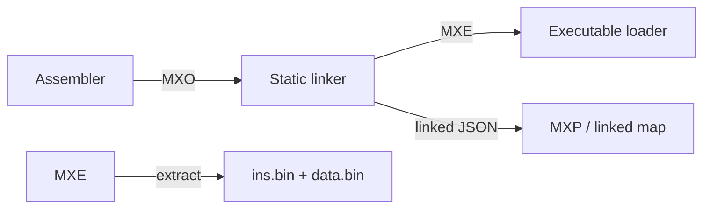

# MXSM Binary Object and Executable Formats

MXSM uses two binary formats:

- **MXO**: relocatable object files produced by the assembler and consumed by
  the linker.
- **MXE**: linked executable images produced by the linker and consumed by a
  loader or by `mxsm extract`.

All metadata integers in both formats are little-endian. Section payload bytes
retain the target ISA endianness recorded in the file header.



## MXO relocatable object

An MXO file is table-oriented and does not allocate the complete address
space. Its layout is:

```text
fixed header
section table
symbol table
relocation table
string table
section payloads
```

### Header

The header is 32 bytes and uses the struct layout
`<8sHHBBBBIIII`.

| Field | Size | Description |
|---|---:|---|
| `magic` | 8 | `MX`, address-width bytes, data-width bytes, four zero bytes |
| `version` | 2 | Format version; currently `1` |
| `flags` | 2 | Reserved; currently `0` |
| `address_width` | 1 | Address width in bits |
| `data_width` | 1 | Data width in bits |
| `endianness` | 1 | `0` little-endian, `1` big-endian |
| `section_count` | 1 | Number of section records |
| `section_table_offset` | 4 | File offset of section table |
| `symbol_table_offset` | 4 | File offset of symbol table |
| `relocation_table_offset` | 4 | File offset of relocation table |
| `string_table_offset` | 4 | File offset of string table |

For the MX/11-70 definition, the signature is:

```text
4d 58 01 01 00 00 00 00
```

The `01 01` means one byte of storage for both addresses and data values.

### Section records

Each section record is 32 bytes (`<IBBHQQQ>`):

| Field | Size | Description |
|---|---:|---|
| `name_offset` | 4 | Offset of NUL-terminated name in string table |
| `kind` | 1 | Section kind; currently `1` |
| `flags` | 1 | Reserved; currently `0` |
| `alignment` | 2 | Alignment; currently `1` |
| `address` | 8 | Section-relative or fixed input address |
| `file_offset` | 8 | Payload offset in the file |
| `size` | 8 | Payload size in bytes |

Assembler sections are normally `ins`, `data`, `nmi`, and `irq`. Relocatable
sections contain only populated ranges. Fixed interrupt sections retain their
vector addresses.

### Symbol records

Each symbol record is 16 bytes (`<IHHQ>`):

| Field | Size | Description |
|---|---:|---|
| `name_offset` | 4 | Symbol name offset in string table |
| `section` | 2 | Zero-based section-table index |
| `flags` | 2 | Bit `0`: exported; bit `1`: imported |
| `offset` | 8 | Section-relative symbol offset |

An imported symbol has no local definition and is retained so relocation
records can reference it. Exported symbols are candidates for resolution by
other object files.

### Relocation records

Each relocation record is 28 bytes (`<HHQI qHH>`):

| Field | Size | Description |
|---|---:|---|
| `section` | 2 | Section containing the relocation |
| `type` | 2 | `1` means absolute relocation |
| `offset` | 8 | Byte offset in the section |
| `symbol` | 4 | Zero-based symbol-table index |
| `addend` | 8 | Signed value added to the symbol address |
| `width` | 2 | Relocated field width in bits |
| `reserved` | 2 | Reserved; currently `0` |

The current linker supports positive, byte-aligned absolute relocations.
Instruction bit-field relocations require additional field-offset metadata and
are not yet fully represented by MXO.

### Strings and payloads

The string table begins with a NUL byte. Names are UTF-8 and NUL-terminated.
Section payloads follow the string table and are located by each section's
`file_offset` and `size`.

## MXE executable

MXE is a compact linked executable containing sparse, loadable sections:

```text
MXE header
section records
section payloads
```

### Header

The header is 20 bytes and uses `<4sHBBBBQH>`.

| Field | Size | Description |
|---|---:|---|
| `magic` | 4 | ASCII `MXE\0` |
| `version` | 2 | Format version; currently `1` |
| `address_bytes` | 1 | Address storage width in bytes |
| `data_bytes` | 1 | Data storage width in bytes |
| `endianness` | 1 | `0` little-endian, `1` big-endian |
| `section_count` | 1 | Number of section records |
| `entry` | 8 | Entry-point address; `0` if unspecified |
| `record_count` | 2 | Must equal `section_count` |

### Section records

Each record is 40 bytes (`<16sQQQ>`):

| Field | Size | Description |
|---|---:|---|
| `name` | 16 | NUL-terminated ASCII section name |
| `address` | 8 | Load address |
| `payload_offset` | 8 | File offset of section data |
| `payload_size` | 8 | Number of payload bytes |

The payloads are concatenated after the section-record table. The loader maps
each payload at its recorded address and starts execution at `entry`.

MXE does not contain relocation records: linking has already resolved them.
It also does not require zero-filled gaps between sections, so it remains
suitable for sparse memory maps.

## Extracting raw images

Convert an MXE to dense instruction and data images:

```shell
mxsm extract program.mxe -o build/raw
```

This creates `build/raw/ins.bin` and `build/raw/data.bin`, each sized to the
address space described by the MXE header. Unmapped bytes are zero-filled.
The `ins`, `nmi`, and `irq` sections are copied into `ins.bin` at their
recorded addresses. The `data` section is copied into `data.bin`; other
sections are ignored by raw-image extraction.
